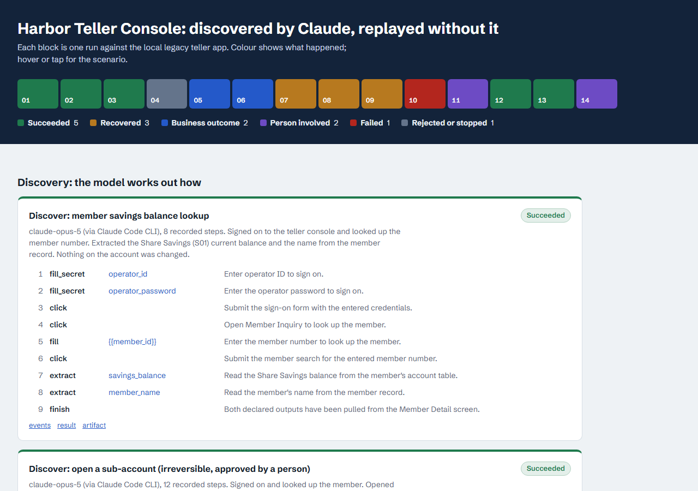
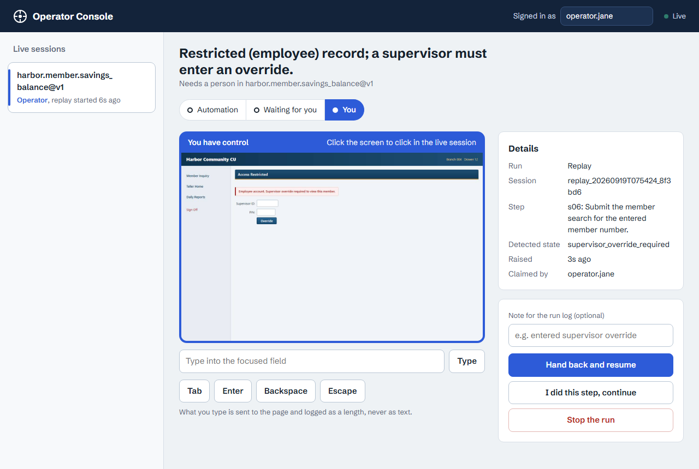

# Computer-Use Automation System

An LLM discovers how to accomplish a goal in a legacy back-office UI; the run is compiled into a
typed, versioned **capability**; an AI agent then invokes that capability through
**deterministic replay** (no model in the loop) with typed inputs, typed outputs, and an explicit
outcome taxonomy. When automation can't safely proceed, a human takes over the **same live
session** from an operator console and hands control back.

- Design write-up: [`REPORT.md`](REPORT.md)
- Evidence (discovery + replays, incl. failures and a human handoff): [`evidence/`](evidence/)
- Example artifact: [`evidence/capability.json`](evidence/capability.json)
- **Video walkthrough (≈3 min):** [`evidence/demo.mp4`](evidence/demo.mp4) — Claude discovers the
  flow, replays with outcomes and recovery, a person takes over the live session, and the same
  capability runs on a second tenant.

## At a glance

**Every run, coloured by what happened** ([`evidence/index.html`](evidence/index.html)): green
succeeded, amber recovered, blue business outcome, violet a person was involved, red failed.



**The operator console** — a run stopped for a supervisor override; the operator holds control of
the same live browser session and hands it back when done.



**The target** — a deliberately legacy teller console (framesets, table layouts, no ids; all
data synthetic). Credits
are green with a `+`, debits red in parentheses, so the meaning never depends on colour alone.


## Setup

Requirements: [uv](https://docs.astral.sh/uv/) (installs Python 3.12 itself). `make` is optional
— every target is a one-line `uv run …` command you can run directly (see [`Makefile`](Makefile)).

```sh
uv sync
uv run playwright install chromium
cp .env.example .env
```

Discovery needs Claude, via **either**:
- an API key: set `ANTHROPIC_API_KEY` in `.env` (default decider, `--decider claude`), or
- a Claude subscription (Pro/Max) through the [Claude Code](https://code.claude.com) CLI: log
  in once with `claude`, then pass `--decider claude-code`. Each step is an isolated
  `claude -p` call (no tools, no settings/memory, JSON-schema-constrained reply).

Configuration (validated at startup, see [`.env.example`](.env.example)):

| Variable | Purpose |
| --- | --- |
| `ANTHROPIC_API_KEY` | Discovery via the API (or use `--decider claude-code`). Replay never calls a model. |
| `LLM_MODEL` | Default `claude-opus-5`. |
| `TARGET_BASE_URL` | Tenant app instance (default: the local demo bank, `http://localhost:8001`). |
| `ALLOWED_HOSTS` | Hosts automation may reach (policy + network-level enforcement). |
| `HARBOR_OPERATOR_ID` / `HARBOR_OPERATOR_PASSWORD` | Tenant credentials, referenced by capabilities by env name only (synthetic values for the demo app are in `.env.example`). |
| `HANDOFF_TIMEOUT_S` | How long a run waits for a human before aborting. |

## Demo path

Terminal 1 — the target app (a deliberately legacy teller console: framesets, table layouts,
no ids; synthetic data):

```sh
uv run assessments demo-bank                 # http://localhost:8001  (operator teller1 / harbor-demo)
```

Terminal 2 — **discover** a capability with Claude, then **replay** it:

```sh
uv run assessments discover catalog/tasks/member_savings_balance.json --example member_id=12345
#   (add --decider claude-code to use a Claude subscription instead of an API key)
#   → catalog/capabilities/harbor.member.savings_balance/v1.json   (+ evidence in data/runs/<run>)

uv run assessments replay harbor.member.savings_balance --param member_id=48213
#   → {"status": "succeeded", "outputs": {"savings_balance": "15032.90", "member_name": "Priya Raman"}, ...}

uv run assessments replay harbor.member.savings_balance --param member_id=99999
#   → {"status": "business_outcome", "outcome": {"code": "member_not_found", ...}}
```

Exceptional states and handoff:

```sh
uv run assessments faults notice=1          # maintenance interstitial → recovered (dismissed)
uv run assessments faults unavailable=2     # transient 503 → recovered (retried)
uv run assessments faults server_error=1    # application error page → failed, with evidence
uv run assessments replay harbor.member.savings_balance --param member_id=12345

# Restricted record → escalation. Open http://127.0.0.1:8000/operator, "Take control",
# click into the Supervisor ID / PIN fields in the live view (sup01 / 4321), click Override,
# then "Hand back control" with `resume`. The run continues on the same session.
uv run assessments replay harbor.member.savings_balance --param member_id=20417
#   (or add --simulate-operator to have a scripted operator do it via the same console API)
```

A second tenant on the same product (relabelled UI) — same artifact, drift reported:

```sh
uv run assessments demo-bank --port 8002 --variant b
uv run assessments replay harbor.member.savings_balance --param member_id=12345 --base-url http://localhost:8002
#   → succeeded, "degraded_locators": [s04 css, s05 field_name, s06 css, s07 css]
```

Irreversible actions (sub-account opening; `Confirm` commits a transfer):

```sh
uv run assessments discover catalog/tasks/open_sub_account.json --example member_id=12345 \
  --example product="Vacation Club" --example initial_deposit=25.00 --simulate-operator   # approval needed
uv run assessments capabilities approve harbor.member.open_sub_account --reviewer you
uv run assessments replay harbor.member.open_sub_account --param member_id=12345 \
  --param product="Vacation Club" --param initial_deposit=25.00 --allow-irreversible
```

All evidence at once (what produced [`evidence/`](evidence/)):

```sh
uv run python scripts/generate_evidence.py --decider claude-code   # 2 Claude discoveries + 12 replays
```

### Without live services

- No model access at all: `--decider offline` (or `make discover-offline`) runs discovery with a scripted
  stand-in through the exact same loop, policy, recording and compiler. It is a test double,
  not discovery; `scripts/generate_evidence.py --decider offline` does the same for the evidence set.
- Replay never needs a model. The demo bank is local.

### Agent-facing API

`uv run assessments serve` → `GET /api/capabilities` (contracts: inputs, outputs, business
outcomes, side effects) and `POST /api/capabilities/{id}/invoke` with
`{"params": {...}}`. Drafts require `"attended": true`; approved capabilities run unattended.
Operator console at `/operator`.

## Development

```sh
make verify       # ruff format/lint → mypy --strict → unit + integration tests
make test-e2e     # real Chromium + demo bank: discovery, replay matrix, handoff, approval
make audit        # pip-audit
```

| Layer | Location |
| --- | --- |
| Unit (pure logic: schema, values, redaction, policy, control) | `tests/unit/` |
| Integration (API in-process) | `tests/integration/` |
| E2E (browser + demo bank, no model calls) | `tests/e2e/` |
| Model-behavior evals (separate from tests) | `evals/` |

## Docker

```sh
docker compose up --build          # demo bank :8001 + service (catalog API, operator console) :8000
docker compose run --rm app replay harbor.member.savings_balance --param member_id=12345
```

Multi-stage image (`python:3.12-slim-bookworm` + Chromium headless shell), non-root, read-only
root filesystem, all capabilities dropped. ~1.3 GB, dominated by Chromium and its libraries.

## Layout

```
src/assessments/
  capability/   schema (capability/1), values, app profiles, file store
  surfaces/     Surface protocol; web/ = Playwright implementation + injected cu.js
  agent/        action space, deciders (Claude, scripted), discovery loop + compiler
  replay/       deterministic engine + result contract
  session/      control-transfer state machine, live-session runtime
  api/          FastAPI: capability catalog, operator console
  safety.py  redaction.py  runs.py (evidence)  secrets.py  cli.py
src/demo_bank/  the legacy-style target app (+ fault injection, tenant variant)
catalog/        profiles/ (per vendor product), tasks/ (discovery specs), capabilities/ (artifacts)
evidence/       recorded runs;  REPORT.md  design write-up
```
