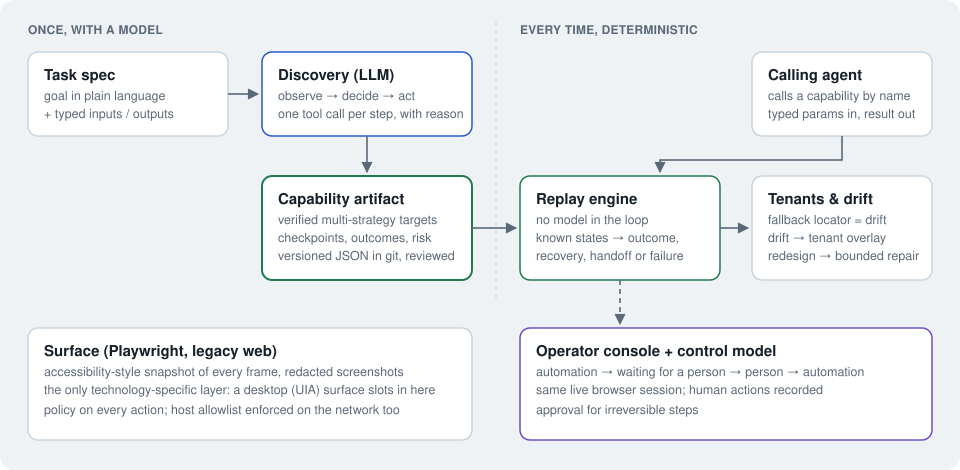
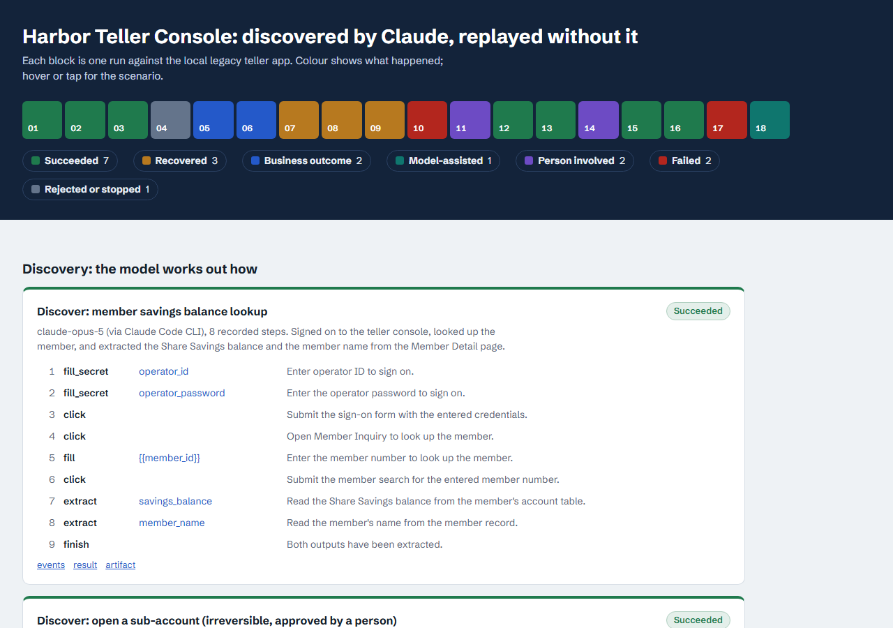
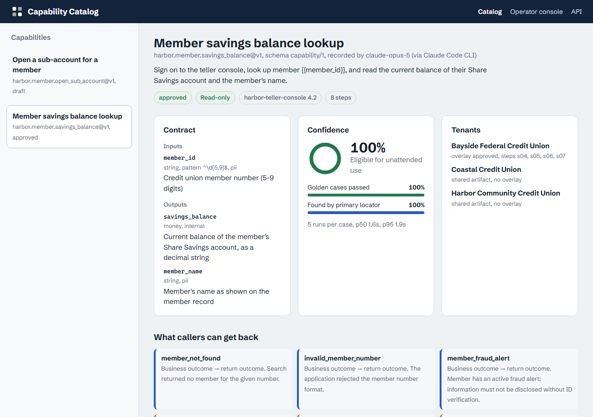
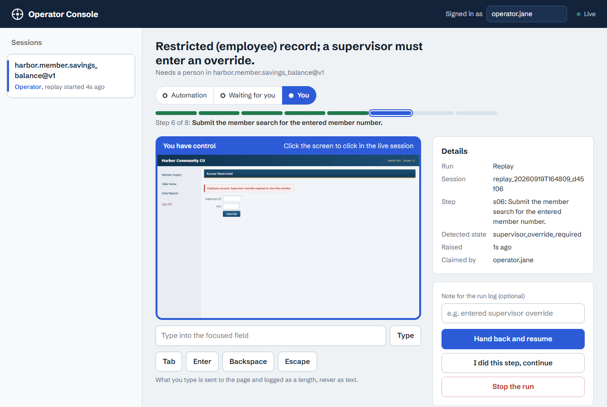
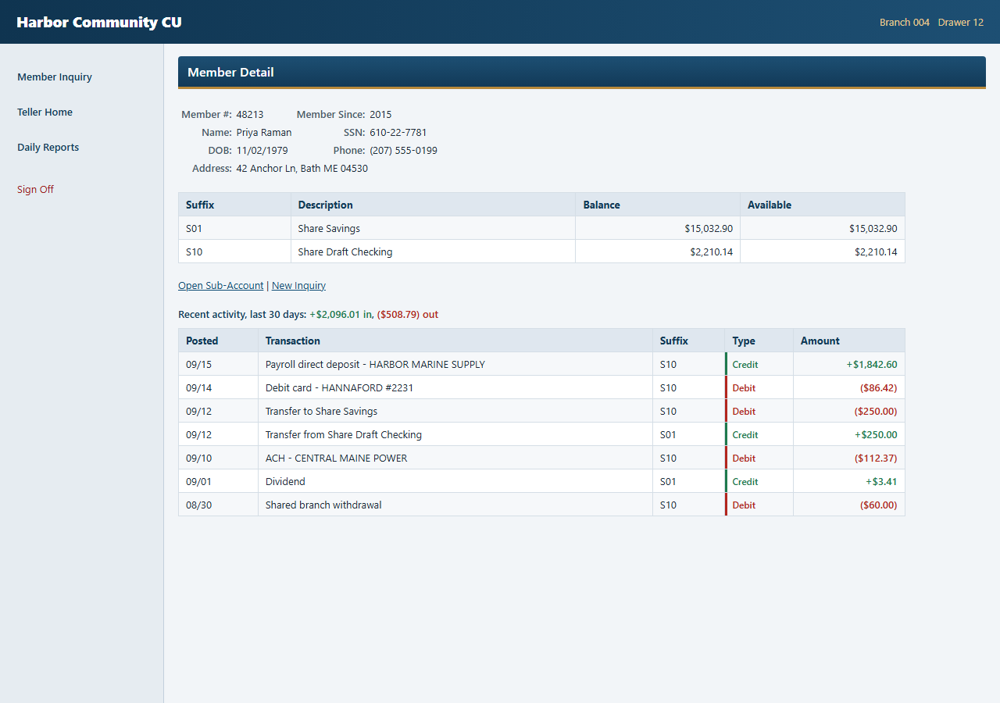

# Computer-Use Automation System

An LLM works out how to do a task in a legacy back-office UI **once**. The successful run is
compiled into a typed, versioned **capability**, and every later execution is a **deterministic
replay with no model in the loop**: typed inputs and outputs, an explicit outcome taxonomy, and
evidence for every run. When automation can't safely proceed, a person takes over the **same live
session** and hands control back.

| Start here | |
| --- | --- |
| **Video walkthrough** (3 min) | [`evidence/demo.mp4`](evidence/demo.mp4) — the target app, discovery, replay outcomes, recovery, a person taking over the live session, tenant drift, then the two stretch goals |
| Design write-up | [`REPORT.md`](REPORT.md) — the seven headings the brief asks for |
| Requirement-by-requirement check | [`COMPLIANCE.md`](COMPLIANCE.md) — every line of the brief → code, tests, evidence |
| Evidence (real `claude-opus-5` runs) | [`evidence/`](evidence/) — open [`evidence/index.html`](evidence/index.html) for the colour-coded overview |
| A real artifact | [`evidence/capability.json`](evidence/capability.json) |

## The design in one picture

```
 goal + typed contract
        │
        ▼
 Discovery ── observe → decide (LLM) → policy → act ──┐        once, with a model
        │                                              │
        ▼                                              ▼
 capability compiler ──► versioned artifact (JSON, reviewed)
 ─────────────────────────────────────────────────────────────────────────────────
                                  │                                every time, no model
                                  ▼
           Replay engine: resolve target ▸ policy ▸ act ▸ checkpoint ──► typed result
                  │                                                     (succeeded │
                  │ stuck / risky / known escalation state              business_outcome │
                  ▼                                                     rejected │ failed)
           Human handoff: a person operates the same live session, hands back

 Both halves act only through the Surface contract (Playwright = legacy web today).
```



Three decisions carry the design:

- **The artifact is a contract, not a recording.** No transcript, no raw values, no coordinates:
  typed inputs/outputs, steps with several verified ways to find each element, a checkpoint per
  step, and the business outcomes a caller can get back (declared once per vendor product in the
  app profile, so every capability for that product shares them).
- **Replay never asks a model** (unless the opt-in repair below is enabled). It waits on conditions, recognises known screens (not found,
  maintenance notice, expired session, 503, supervisor override…) and responds to each one
  deliberately. Anything unexpected is a failure with the step, what was expected and what was on
  screen.
- **Technology stays behind a seam.** The agent loop, artifact, replay engine and policy speak only
  the `Surface` protocol; Playwright is one implementation. The model is behind a `Decider`
  interface; the provider is an adapter.

## The artifact

A trimmed excerpt of [`evidence/capability.json`](evidence/capability.json), recorded by
`claude-opus-5` against the teller console (CSS paths shortened):

```jsonc
{
  "schema_version": "capability/1",
  "id": "harbor.member.savings_balance", "version": 1,
  "app": { "product": "harbor-teller-console", "product_version": "4.2", "surface": "legacy_web" },
  "inputs":  { "member_id": { "type": "string", "pattern": "^\\d{5,9}$", "sensitivity": "pii" } },
  "outputs": { "savings_balance": { "type": "money", "sensitivity": "internal" }, "member_name": … },
  "secrets": { "operator_id": { "env": "HARBOR_OPERATOR_ID" }, … },  // references, never values
  "steps": [
    …
    { "id": "s05", "intent": "Enter the member number to look up the member.",
      "action": "fill", "value": { "param": "member_id" }, "risk": "safe",
      "target": { "scope": { "frames": ["main"] }, "strategies": [
        { "kind": "label",      "label": "Member #:" },
        { "kind": "field_name", "name": "mbrno" },
        { "kind": "css",        "selector": "body > form > table > … > input" } ] } },
    { "id": "s06", "action": "click", "target": { … "button \"Search\"" … },
      "expect": [ { "kind": "screen_title", "title": "Member Detail", "scope": { "frames": ["main"] } } ] },
    { "id": "s07", "intent": "Read the Share Savings balance from the member's account table.",
      "action": "extract", "output": "savings_balance",
      "target": { "strategies": [
        { "kind": "table_cell", "row_key": "Share Savings", "column": "Balance" },
        { "kind": "css", "selector": "body > table:nth-of-type(3) > … > td:nth-of-type(3)" } ] } }
  ],
  "outcomes": [],   // capability-specific extras; product-wide ones come from the app profile
  "review": { "status": "draft" },   // until a person approves it
  "provenance": { "model": "claude-opus-5 (via Claude Code CLI)", "human_steps": 0, … }
}
```

**Why locators are ranked `role → label → field_name → href → table_cell → text → css`.** The
order is *most meaningful and most portable first, most structural last*:

| Strategy | Identifies the element by | Survives | Why this position |
| --- | --- | --- | --- |
| `role` + name | what a person perceives: "button Search" | restyling, layout and markup changes | Same concept as a desktop accessibility tree (UIA ControlType + Name), so it carries over to non-web surfaces. |
| `label` | the visible label, even in a neighbouring table cell | restyling, markup changes | Legacy screens rarely wire `<label for>`; the label a teller reads is still the meaning of the field. |
| `field_name` | the form's POST name (`mbrno`) | relabelling by a tenant | The server's contract, so it outlives UI wording, but it is web-specific, so it sits behind the portable ones. |
| `href` | the route a link goes to | link text changes | Same reasoning as `field_name`, for navigation. |
| `table_cell` | row key × column header ("Share Savings" × "Balance") | row order, extra columns | Values are addressed by meaning, not position. |
| `text` | visible text alone | little | Often ambiguous; only used when unique. |
| `css` | structural path | nothing much | Last resort. Using it is reported as drift, and it is refused if the element's role differs from the recorded one: clicking the *wrong* element is worse than stopping. |

Every strategy is **verified at record time** to resolve to exactly the element the model acted
on; unverified strategies are dropped. At replay the first strategy that resolves uniquely wins;
if it is not the first, the step is listed in `degraded_locators`, so drift is visible before it
becomes a failure.

## What if there is no DOM?

The artifact, the replay engine, the outcome taxonomy, the policy and the handoff model do not
depend on Playwright or HTML. Playwright is one `Surface` implementation
([`surfaces/base.py`](src/assessments/surfaces/base.py)): it produces observations
(elements with roles, names, labels, table cells) and performs actions. A desktop surface
provides the same observations from the OS accessibility tree (UIA: ControlType + Name → `role`,
LabeledBy → `label`, AutomationId → `field_name`, window path → `scope`) and acts through OS-level
input. Screens with no accessibility tree at all (Citrix, canvas) add one more strategy kind
(OCR text or an image anchor); the artifact format and everything above it stay the same. Only
the legacy web surface is built here; the mapping is in [REPORT §4](REPORT.md#4-heterogeneity--multi-tenant).

## Stretch goals: two, in depth

The brief asks for "at most one or two — depth over breadth". These are the two, and both extend
the core rather than sit beside it:

| | What it does | Evidence |
| --- | --- | --- |
| **Cross-tenant reuse with overlays** | A capability is keyed by vendor *product*, not tenant. On a second credit union that relabels screens, replay still succeeds and reports drift. The drifting steps are re-derived on that tenant's own screens into a **draft overlay**; once a person approves it, that tenant replays with zero drift and the shared artifact is untouched. | runs 12 → 15 → 16, [`overlay-bayside.json`](evidence/overlay-bayside.json) |
| **Bounded assisted fallback** | Opt-in (`--assist`). When a redesign removes an element entirely, replay asks the model **once** to pick it on the live screen. The pick is verified, irreversible controls are excluded, and the fix is returned as a *proposal* for review, never written into the artifact. | runs 17 → 18 |

### Additional experiments

Small, optional pieces kept in the repo because they were cheap on top of the core. They are not
part of the design argument: a **certification** command (golden cases replayed N times →
pass rate × primary-locator rate), an **MCP server** exposing capabilities as tools, and
**codegen** to a standalone Playwright test. Commands are in [Development](#development).

## At a glance

**Every run, coloured by what happened** — green succeeded, amber recovered, blue business
outcome, teal model-assisted, violet a person was involved, red failed:



**The capability catalog** — the artifact as a reviewer reads it: typed contract, tenants, what
callers can get back, and every step's locators in rank order:



**The operator console** — a run stopped for a supervisor override; the operator holds control of
the same live browser session and hands it back:



**The target** — a deliberately legacy teller console (framesets, table layouts, no ids; all data
synthetic). Credits are green with `+`, debits red in parentheses, so meaning never depends on
colour alone:



## Setup

Requirements: [uv](https://docs.astral.sh/uv/) (installs Python 3.12 itself). `make` is optional:
every target is a one-line `uv run …` command (see [`Makefile`](Makefile)).

```sh
uv sync
uv run playwright install chromium
cp .env.example .env
```

**Model access** is only needed for discovery (and the opt-in repair). Discovery talks to a
`Decider` interface; the provider is chosen with `--decider`:

| `--decider` | Adapter | Needs |
| --- | --- | --- |
| `claude` | Anthropic Messages API (tool use, snapshot + screenshot) | `ANTHROPIC_API_KEY` in `.env` |
| `claude-code` | Claude Code CLI on a Claude subscription: one isolated `claude -p` call per step (no tools, settings or memory; JSON-schema reply). Used for the evidence. | `claude` logged in once |
| `offline` | Scripted stand-in: exercises the same loop, policy, recording and compiler. A test double, **not** discovery. | nothing |

Configuration is validated at startup ([`.env.example`](.env.example) lists everything):

| Variable | Purpose |
| --- | --- |
| `ANTHROPIC_API_KEY` / `LLM_MODEL` | Discovery via the API (default model `claude-opus-5`). Replay never calls a model. |
| `TARGET_BASE_URL` | Default tenant app instance (the local demo bank, `http://localhost:8001`). |
| `ALLOWED_HOSTS`, `ALLOWED_PATHS`, `ALLOWED_ACTIONS` | Policy allowlists: hosts (also enforced on the network), URL paths, action types. |
| `HARBOR_OPERATOR_ID` / `HARBOR_OPERATOR_PASSWORD` | Tenant credentials, referenced by capabilities by env name only (synthetic values for the demo). |
| `HANDOFF_TIMEOUT_S` | How long a run waits for a person before aborting. |

## Demo path

Terminal 1, the target app (sign on with `teller1` / `harbor-demo`):

```sh
uv run assessments demo-bank                       # http://localhost:8001
```

Terminal 2, **discover** a capability, then **replay** it:

```sh
uv run assessments discover catalog/tasks/member_savings_balance.json --example member_id=12345 \
  --decider claude-code                            # or --decider claude with an API key
#   → catalog/capabilities/harbor.member.savings_balance/v1.json  (+ evidence in data/runs/<run>)

uv run assessments replay harbor.member.savings_balance --param member_id=48213
#   → {"status": "succeeded", "outputs": {"savings_balance": "15032.90", "member_name": "Priya Raman"}, …}

uv run assessments replay harbor.member.savings_balance --param member_id=99999
#   → {"status": "business_outcome", "outcome": {"code": "member_not_found", …}}
```

Runtime trouble and a person taking over:

```sh
uv run assessments faults notice=1          # maintenance interstitial → recovered (dismissed)
uv run assessments faults unavailable=2     # transient 503 → recovered (retried)
uv run assessments faults server_error=1    # application error page → failed, with evidence
uv run assessments replay harbor.member.savings_balance --param member_id=12345

# Restricted record → escalation. The replay command hosts the operator console itself. Open
# http://127.0.0.1:8000/operator, "Take control", click into
# the Supervisor ID / PIN fields in the live view (sup01 / 4321), click Override, then
# "Hand back and resume". The run continues on the same session.
uv run assessments replay harbor.member.savings_balance --param member_id=20417
#   (--simulate-operator lets a scripted operator do the same through the console API)
```

Irreversible actions (opening a sub-account; `Confirm` commits a transfer):

```sh
uv run assessments discover catalog/tasks/open_sub_account.json --example member_id=12345 \
  --example product="Vacation Club" --example initial_deposit=25.00 --simulate-operator
uv run assessments capabilities approve harbor.member.open_sub_account --reviewer you --force \
  --notes "reviewed manually"
uv run assessments replay harbor.member.open_sub_account --param member_id=12345 \
  --param product="Vacation Club" --param initial_deposit=25.00 --allow-irreversible
```

The two stretch goals, on other tenants of the same product:

```sh
uv run assessments demo-bank --port 8002 --variant b      # Bayside: relabelled screens
uv run assessments demo-bank --port 8003 --variant c      # Coastal: redesigned menu
uv run assessments replay harbor.member.savings_balance --param member_id=12345 --tenant bayside
#   → succeeded, with degraded_locators (drift)
uv run assessments overlay propose harbor.member.savings_balance --tenant bayside --param member_id=12345
uv run assessments overlay approve harbor.member.savings_balance --tenant bayside --reviewer you
uv run assessments replay harbor.member.savings_balance --param member_id=12345 --tenant bayside
#   → succeeded, overlay "bayside (approved)", no drift
uv run assessments replay harbor.member.savings_balance --param member_id=12345 --tenant coastal
#   → failed: target_not_found (the redesign removed the recorded link)
uv run assessments replay harbor.member.savings_balance --param member_id=12345 --tenant coastal \
  --assist claude-code                                    # one bounded repair, proposed for review
```

Everything in [`evidence/`](evidence/) and the video are reproducible:

```sh
uv run python scripts/generate_evidence.py --decider claude-code
uv run --with imageio-ffmpeg python scripts/record_demo.py --decider claude-code
```

### Without live services

- No model access: `--decider offline` runs discovery with a scripted stand-in through the exact
  same loop, policy, recording and compiler. It is a test double, not discovery.
- Replay, overlays and the handoff never need a model. The demo bank is local.

## Development

```sh
make verify       # ruff format/lint → mypy --strict → unit + integration tests
make test-e2e     # real Chromium + three demo tenants: discovery, replay matrix, handoff, overlays, repair
make audit        # pip-audit
```

| Layer | Location |
| --- | --- |
| Unit (schema, values, redaction, policy, control, overlays) | `tests/unit/` |
| Integration (API in-process) | `tests/integration/` |
| E2E (browser + demo bank, no model calls) | `tests/e2e/` |
| Model-behavior evals (separate from tests) | `evals/` |

Additional experiments:

```sh
uv run assessments certify harbor.member.savings_balance --runs 5   # golden cases × N → confidence
uv run assessments mcp                                              # capabilities as MCP tools (stdio)
uv run assessments codegen harbor.member.savings_balance --param member_id=48213   # standalone Playwright test
```

## Docker

No setup needed: compose loads the synthetic defaults from `.env.example` (a `.env` overrides them).

```sh
docker compose up --build          # demo bank :8001 + service :8000 (/catalog, /operator, /docs)
docker compose run --rm app replay harbor.member.savings_balance --param member_id=48213

# A handoff through the running service: this call waits for a person. Open
# http://127.0.0.1:8000/operator, take control, and resolve it.
curl -X POST http://127.0.0.1:8000/api/capabilities/harbor.member.savings_balance/invoke   -H 'content-type: application/json' -d '{"params": {"member_id": "20417"}}'
```

Multi-stage image (`python:3.12-slim-bookworm` + Chromium headless shell), non-root, read-only root
filesystem, all capabilities dropped. ~1.3 GB, dominated by Chromium and its libraries.

## Layout

```
src/assessments/
  capability/   schema (capability/1), values, profiles, store, overlays   (+ certification, codegen)
  surfaces/     Surface protocol; web/ = Playwright implementation + injected cu.js
  agent/        action space, Decider interface + provider adapters, discovery + compiler
  replay/       deterministic engine (+ opt-in bounded repair) and result contract
  session/      control-transfer state machine, live sessions, activity feed
  api/          FastAPI: capability catalog (+ page), operator console
  safety.py redaction.py runs.py secrets.py cli.py   (+ mcp_server.py)
src/demo_bank/  the legacy-style target app (fault injection, tenant variants b and c)
catalog/        profiles/, tasks/, capabilities/, tenants/, overlays/, certification/
evidence/       recorded runs, overview page, video;   REPORT.md, COMPLIANCE.md
```
